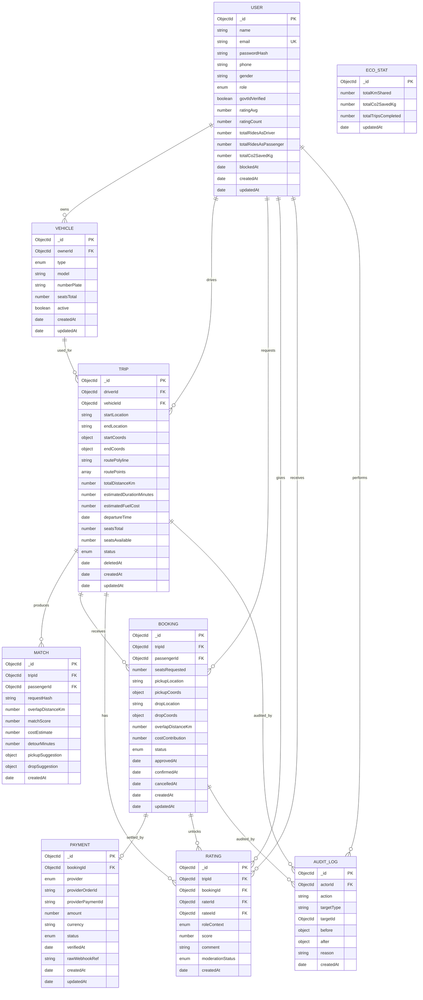
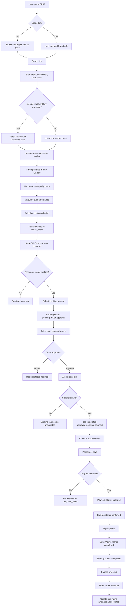
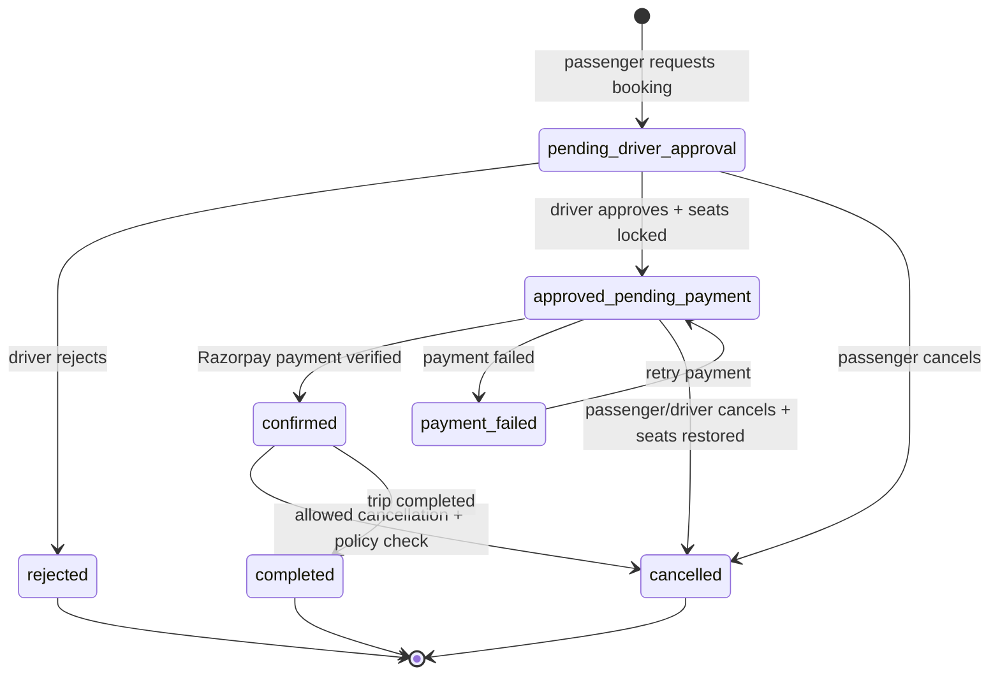
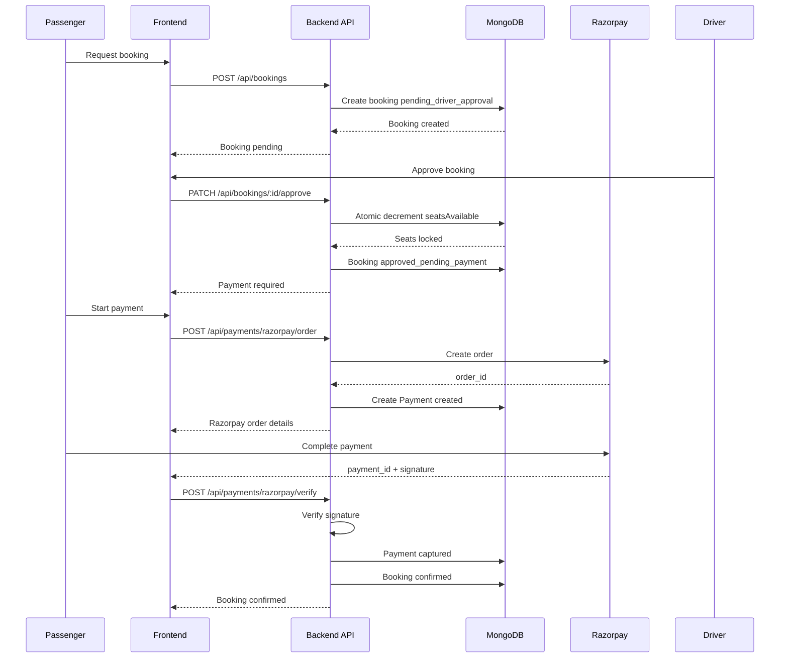
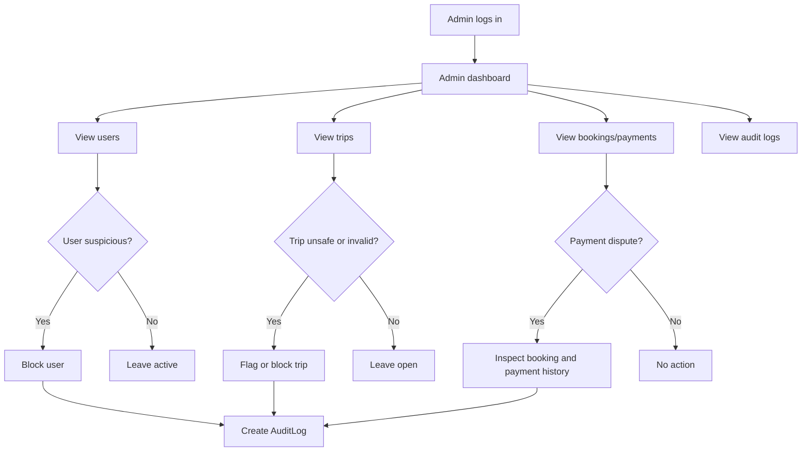

# CRSP Database Workflow, Attributes, and Visual Connections

## 1. Database Entity Relationship Diagram

## 2. Database Tables and Attribute Connections

### User

| Attribute | Type | Key | Connected To | Purpose |
|---|---:|---|---|---|
| `_id` | ObjectId | Primary Key | `Vehicle.ownerId`, `Trip.driverId`, `Booking.passengerId`, `Rating.raterId`, `Rating.rateeId`, `AuditLog.actorId` | Unique user identity. |
| `name` | String | - | UI profile, trip cards | User display name. |
| `email` | String | Unique | Auth login | Login identifier. |
| `passwordHash` | String | - | Auth service | Secure hashed password. |
| `phone` | String | - | Profile/contact | Optional contact info. |
| `gender` | String | - | Profile/safety filters | Optional profile field. |
| `role` | Enum | Indexed | Admin middleware, protected routes | Controls passenger, driver, admin permissions. |
| `govtIdVerified` | Boolean | - | TripCard/Profile trust badge | Shows verification trust signal. |
| `ratingAvg` | Number | - | TripCard/Profile | Average received rating. |
| `ratingCount` | Number | - | Rating aggregation | Number of ratings received. |
| `totalRidesAsDriver` | Number | - | Profile/stats | Driver ride history count. |
| `totalRidesAsPassenger` | Number | - | Profile/stats | Passenger ride history count. |
| `totalCo2SavedKg` | Number | - | Eco stats | Personal environmental impact. |
| `blockedAt` | Date | - | Admin moderation | Blocks access when set. |
| `createdAt`, `updatedAt` | Date | - | Audit/debug | Record lifecycle. |

### Vehicle

| Attribute | Type | Key | Connected To | Purpose |
|---|---:|---|---|---|
| `_id` | ObjectId | Primary Key | `Trip.vehicleId` | Unique vehicle identity. |
| `ownerId` | ObjectId | Foreign Key | `User._id` | Vehicle owner/driver. |
| `type` | Enum | - | Trip creation | Car, bike, or auto. |
| `model` | String | - | Trip detail UI | Vehicle display. |
| `numberPlate` | String | - | Safety/admin | Vehicle verification detail. |
| `seatsTotal` | Number | - | Trip seat defaults | Max seats vehicle can offer. |
| `active` | Boolean | - | Trip posting | Prevent inactive vehicle use. |
| `createdAt`, `updatedAt` | Date | - | Audit/debug | Record lifecycle. |

### Trip

| Attribute | Type | Key | Connected To | Purpose |
|---|---:|---|---|---|
| `_id` | ObjectId | Primary Key | `Match.tripId`, `Booking.tripId`, `Rating.tripId` | Unique trip identity. |
| `driverId` | ObjectId | Foreign Key | `User._id` | Driver who posted the trip. |
| `vehicleId` | ObjectId | Foreign Key | `Vehicle._id` | Vehicle used for trip. |
| `startLocation` | String | - | Search/UI | Human-readable origin. |
| `endLocation` | String | - | Search/UI | Human-readable destination. |
| `startCoords` | Object | 2dsphere | Maps/search | Origin latitude/longitude. |
| `endCoords` | Object | 2dsphere | Maps/search | Destination latitude/longitude. |
| `routePolyline` | String | - | Maps/matching | Encoded Google route. |
| `routePoints` | Array | - | Matching service | Decoded route points for overlap. |
| `totalDistanceKm` | Number | - | Cost formula | Full trip distance. |
| `estimatedDurationMinutes` | Number | - | Search/matching | Trip duration estimate. |
| `estimatedFuelCost` | Number | - | Cost formula/payment | Driver-entered or estimated fuel cost. |
| `departureTime` | Date | Indexed | Match filtering | Time-based search. |
| `seatsTotal` | Number | - | Booking limit | Original offered seats. |
| `seatsAvailable` | Number | Indexed | Booking lock | Available seats after approvals. |
| `status` | Enum | Indexed | Search/admin | draft, open, full, completed, cancelled, flagged, blocked. |
| `deletedAt` | Date | - | Soft delete | Preserve historical records. |
| `createdAt`, `updatedAt` | Date | - | Audit/debug | Record lifecycle. |

### Match

| Attribute | Type | Key | Connected To | Purpose |
|---|---:|---|---|---|
| `_id` | ObjectId | Primary Key | - | Unique match record. |
| `tripId` | ObjectId | Foreign Key | `Trip._id` | Candidate driver trip. |
| `passengerId` | ObjectId | Foreign Key Optional | `User._id` | User who searched, if logged in. |
| `requestHash` | String | Indexed | Match cache/debug | Repeatable search signature. |
| `overlapDistanceKm` | Number | - | Cost calculation | Shared route distance. |
| `matchScore` | Number | - | Ranking | Match quality score. |
| `costEstimate` | Number | - | Booking/payment | Estimated passenger contribution. |
| `detourMinutes` | Number | - | Ranking | Pickup/drop inconvenience. |
| `pickupSuggestion` | Object | - | Booking form | Suggested pickup point. |
| `dropSuggestion` | Object | - | Booking form | Suggested drop point. |
| `createdAt` | Date | - | Debug/cache expiry | Match creation time. |

### Booking

| Attribute | Type | Key | Connected To | Purpose |
|---|---:|---|---|---|
| `_id` | ObjectId | Primary Key | `Payment.bookingId`, `Rating.bookingId` | Unique booking identity. |
| `tripId` | ObjectId | Foreign Key | `Trip._id` | Trip being booked. |
| `passengerId` | ObjectId | Foreign Key | `User._id` | Passenger requesting seat. |
| `seatsRequested` | Number | - | Seat locking | Number of seats requested. |
| `pickupLocation` | String | - | Driver/passenger UI | Pickup address. |
| `pickupCoords` | Object | - | Maps/matching | Pickup coordinates. |
| `dropLocation` | String | - | Driver/passenger UI | Drop address. |
| `dropCoords` | Object | - | Maps/matching | Drop coordinates. |
| `overlapDistanceKm` | Number | - | Cost/payment | Shared distance for this booking. |
| `costContribution` | Number | - | Payment | Amount passenger pays. |
| `status` | Enum | Indexed | Workflow | pending_driver_approval, approved_pending_payment, confirmed, cancelled, completed, rejected, payment_failed. |
| `approvedAt` | Date | - | Workflow audit | Driver approval timestamp. |
| `confirmedAt` | Date | - | Workflow audit | Payment-confirmed timestamp. |
| `cancelledAt` | Date | - | Workflow audit | Cancellation timestamp. |
| `createdAt`, `updatedAt` | Date | - | Audit/debug | Record lifecycle. |

### Payment

| Attribute | Type | Key | Connected To | Purpose |
|---|---:|---|---|---|
| `_id` | ObjectId | Primary Key | - | Unique payment identity. |
| `bookingId` | ObjectId | Foreign Key | `Booking._id` | Booking being settled. |
| `provider` | Enum | - | Payment service | razorpay, stripe, manual. |
| `providerOrderId` | String | Indexed | Razorpay order | Provider order reference. |
| `providerPaymentId` | String | Indexed Optional | Razorpay payment | Provider payment reference. |
| `amount` | Number | - | Payment verification | Amount charged. |
| `currency` | String | - | Payment verification | Usually INR. |
| `status` | Enum | Indexed | Booking confirmation | created, pending, captured, failed, refunded. |
| `verifiedAt` | Date | - | Security/audit | Signature verification time. |
| `rawWebhookRef` | String | - | Debug/audit | Reference to webhook payload/log. |
| `createdAt`, `updatedAt` | Date | - | Audit/debug | Record lifecycle. |

### Rating

| Attribute | Type | Key | Connected To | Purpose |
|---|---:|---|---|---|
| `_id` | ObjectId | Primary Key | - | Unique rating identity. |
| `tripId` | ObjectId | Foreign Key | `Trip._id` | Completed trip. |
| `bookingId` | ObjectId | Foreign Key | `Booking._id` | Completed booking that unlocks rating. |
| `raterId` | ObjectId | Foreign Key | `User._id` | User giving rating. |
| `rateeId` | ObjectId | Foreign Key | `User._id` | User receiving rating. |
| `roleContext` | Enum | - | Trust display | driver or passenger context. |
| `score` | Number | - | Rating aggregation | 1 to 5 score. |
| `comment` | String | - | Profile/admin | Optional feedback. |
| `moderationStatus` | Enum | - | Admin moderation | visible, hidden, flagged. |
| `createdAt` | Date | - | Audit/debug | Rating creation time. |

### AuditLog

| Attribute | Type | Key | Connected To | Purpose |
|---|---:|---|---|---|
| `_id` | ObjectId | Primary Key | - | Unique audit event. |
| `actorId` | ObjectId | Foreign Key Optional | `User._id` | User/admin/system actor. |
| `action` | String | Indexed | Admin dashboard | Action name. |
| `targetType` | String | Indexed | Admin dashboard | User, Trip, Booking, Payment, Rating. |
| `targetId` | ObjectId | Indexed | Related record | Target record ID. |
| `before` | Object | - | Audit comparison | State before action. |
| `after` | Object | - | Audit comparison | State after action. |
| `reason` | String | - | Admin notes | Moderation or cancellation reason. |
| `createdAt` | Date | - | Audit timeline | Event time. |

## 3. Attribute Connection Matrix

| From Table.Attribute | To Table.Attribute | Relationship | Meaning |
|---|---|---|---|
| `Vehicle.ownerId` | `User._id` | Many vehicles to one user | A user owns vehicles. |
| `Trip.driverId` | `User._id` | Many trips to one user | A driver posts many trips. |
| `Trip.vehicleId` | `Vehicle._id` | Many trips to one vehicle | A vehicle can be reused across trips. |
| `Match.tripId` | `Trip._id` | Many matches to one trip | A trip can appear in many passenger searches. |
| `Match.passengerId` | `User._id` | Many matches to one user | Logged-in passenger search history. |
| `Booking.tripId` | `Trip._id` | Many bookings to one trip | A trip can receive multiple bookings. |
| `Booking.passengerId` | `User._id` | Many bookings to one user | A passenger can request many rides. |
| `Payment.bookingId` | `Booking._id` | One payment to one booking | A booking is settled by payment. |
| `Rating.tripId` | `Trip._id` | Many ratings to one trip | Completed trip context. |
| `Rating.bookingId` | `Booking._id` | Many ratings to one booking | Booking unlocks rating rights. |
| `Rating.raterId` | `User._id` | Many ratings from one user | User gives ratings. |
| `Rating.rateeId` | `User._id` | Many ratings to one user | User receives ratings. |
| `AuditLog.actorId` | `User._id` | Many audit logs by one user | Actor performs auditable action. |

## 4. Main Project Workflow Design

## 5. Booking State Workflow

## 6. Route Matching Workflow

```mermaid
flowchart LR
    A[Passenger search request] --> B[Get passenger route]
    B --> C[Decode passenger polyline]
    C --> D[Load candidate open trips]
    D --> E[Decode driver trip polylines]
    E --> F[Compare points within 50 meters]
    F --> G[Build continuous overlap segments]
    G --> H[Calculate overlap_distance_km]
    H --> I[Calculate cost_estimate]
    I --> J[Calculate time proximity score]
    J --> K[Calculate detour penalty]
    K --> L[match_score calculation]
    L --> M[Sort ranked matches]
    M --> N[Return matches to frontend]
```

## 7. Payment and Confirmation Workflow

## 8. Admin Moderation Workflow

## 9. Recommended Indexes

| Collection | Index | Reason |
|---|---|---|
| `users` | `{ email: 1 } unique` | Fast login and duplicate prevention. |
| `users` | `{ role: 1, blockedAt: 1 }` | Admin filtering. |
| `vehicles` | `{ ownerId: 1 }` | Fetch driver vehicles. |
| `trips` | `{ status: 1, departureTime: 1 }` | Search open trips by date/time. |
| `trips` | `{ driverId: 1, departureTime: -1 }` | Driver trip history. |
| `trips` | `{ startCoords: "2dsphere" }` | Origin geospatial search. |
| `trips` | `{ endCoords: "2dsphere" }` | Destination geospatial search. |
| `bookings` | `{ tripId: 1, status: 1 }` | Driver approval queue. |
| `bookings` | `{ passengerId: 1, createdAt: -1 }` | Passenger booking history. |
| `payments` | `{ bookingId: 1 } unique` | One active settlement per booking. |
| `payments` | `{ providerOrderId: 1 }` | Payment verification lookup. |
| `ratings` | `{ raterId: 1, bookingId: 1, rateeId: 1 } unique` | Prevent duplicate ratings. |
| `auditlogs` | `{ targetType: 1, targetId: 1, createdAt: -1 }` | Entity audit history. |

